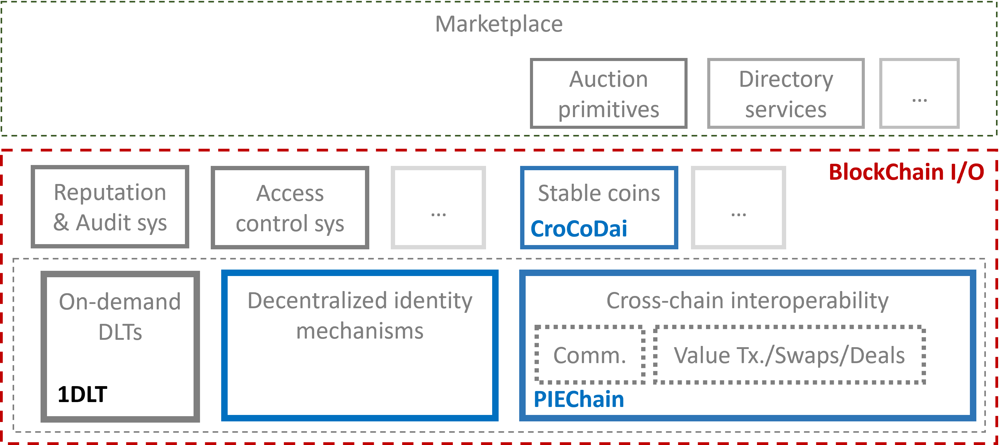

# Blockchain-I-O
In this work, we enumerate a set of additional desirable functionalities required as building blocks for versatile cross-chain commerce, and describe a modular technology stack, BlockChain I/O (see Figure 1) that achieves these desiderata.



## Entities
* The Kafka network provider, who maintains the Kafka network.
* Developers, who develops cross-chain services (CC-SVCs) using an event-
driven approach.
* End users, who deploy smart contracts and use the CC-SVCs for cross- chain operations.

## Setup

### Go
```bash
go mod init github.com/Guy1m0/Blockchain-I-O
sudo go mod tidy
```

### Kafka
Start Kafka with `docker-compose`.
```bash
cd kafka
docker-compose up -d

# to stop after experiments
docker-compose down
```

### Fabric
Install Hyperledger Fabric.
```bash
cd fabric
./install.sh
```

### Ethereum
Install go-ethereum and quorum.
```bash
cd ethereum
sudo ./install.sh
```

## Blockchain I/O
### Setup
1. Setup Docker.
Start kafka
```bash
cd kafka
docker-compose up -d
```

Start Fabric network
```bash
cd fabric-samples/test-network
./network.sh up createChannel -ca
```

Stop Fabric network
```bash
./network.sh down
```

2. Run Ethereum and Quroum.
Go the networks' folders (poa or raft)
```bash
cd ethereum/poa
# cd ethereum/raft for Quorum
./restart.sh
```
To stop after experiment
```bash
./stop.sh
```
NOTE: Check `log.txt` file to ensure that ethereum is running.


3. Go to folder `fabric-samples/test-network` and deploy contracts `fabric_erc20` and `lender` on fabric.
```bash
sudo ./network.sh deployCC -ccn MDai -ccp ../../contracts/fabric_erc20/chaincode -ccl go
```


4. Then deploy `fabric_asset` on `fabric`.
```bash
sudo ./network.sh deployCC -ccn asset -ccp ../../contracts/fabric_asset/chaincode -ccl go
```

5. Go to folder `examples/ecomm/cli` and compile it
```bash
go build .
```
Then run command `init`, `setup` and `display` sequentially
```bash
./cli -c init
./cli -c setup
```

and then show the result
```bash
./cli -c display
```


6. Run `relayer` crosschain service.
```bash
cd examples/ecomm/relayer
sudo go build .
./relayer
```
which is used to monitor all the activities on all three platforms. 

### Place/Withdraw Bid

1. Compile the `auctioneer` script and create new asset.
```bash
cd examples/ecomm/auctioneer
go build .
```

then
```bash
./auctioneer -c create -ast "Asset name" -t "Auction Type"
```

which will return Auction ID in the terminal

2. Place bid on Eth
First compile 
```bash
cd examples/ecomm/bidder
go build .
```

then place MDai `5` bidding on first asset 

```bash
./bidder -c bid -amt 5 -id 1
```

3. Place bid on Quo

Load `Bidder 2` and then place MDai `7` on quo as follows
```bash
./bidder -c bid -usr "Bidder 2" -p quo -amt 7 -id 1
```

4. If Auctioneer cancel the Auction
```bash
./auctioneer -c cancel -id 1
```

Bidder can withdraw MDAI from auction contract
```bash
./bidder -c with -id 1
```

### Auction
1. Close Auction

Go to folder `examples/ecomm/auctioneer`
then use following bash code
```bash
./auctioneer -c close -id 1
```

8. Stop running Containers and Eth private networks

Firstly, stop execution for each signers and relayer.

Then, stop each running networks
```bash
# Raft
cd ethereum/raft
./stop.sh
./remove.sh
# Poa
cd ../poa
./stop.sh
./remove.sh

```
Finally, stop running containers in Docker


```bash
cd fabric-samples/test-network
./network.sh down
cd ../..

cd kafka
docker-compose down
```


The scenario script will do the following steps.
1. Add a new asset on the fabric `asset` contract.
3. Deploy auction contracts on `ethereum` and `quorum`.
2. Create a new auction for this asset on on fabric.
3. Bid correspondingly on both `ethereum` and `quorum`.
4. End auction on `fabric` and print out the winner info and final asset owner on `fabric`.


# Note

## Compile and generate contract go file
Use `eth_english_auction` as example

Go to folder `contracts`
```bash
./gen_contract_go.sh eth_english_auction/
```

> solc --version need to be 0.8.18

## Cert key error 
```bash
Failed to connect to gateway: Failed to apply identity option: Invalid identity format: invalid character 'n' after top-level value
```

It may be caused by the support of RSA, which was later removed during the development of release 2.0. Even v2.2.2 added toleration for RSA public keys in CA certificates for the SW MSP implementation, it highly recommended that using recent release like v2.5.1

It is worthy noting that v2.2.11 might be a alternative release also supports RSA key and cert.

For M1 chip user, better use Fabric no later than v2.5.0 and Fabric-CA no later than v1.5.6

> fixed this error by change `go.mod`. May need extra time to figure out which package cause this error


## Remaining Problem

1. Can not add same AssetID into asset Frabric contract

If Auctioner end one auction based an asset using same assetID, only the most recent auction will be ended.


2. Current Time 

The way to log the current time for each event is not accurte since it is executed in the function. Use `defer` to replace later

3. Front running problem

When auctioneer end the Auction, but before make it to be `ended`, bidder may front-run the auth to call proceed function to claim to be winner. Even this only ends with his token be burned.. Such attack still exisits 

We also assume `endAuction` and `abort` included in one tx

4. Same highestBid

Can check posted events on kafak to see which platform receives hightest bid earlier, but let assume we alread know that or eth is higher (because of gas fee) :)

5. Need two instances of ccsvc to publish and handle events

## Feadback from Reviewers
1.  Some details for the Table 1 experiment - is it for a single submitted order? If so, how many runs is it averaged over etc.
2.  There are other experiments that could have been performed, for ex. the scalability of the system, if 1000 orders were submitted in parallel.


## Todo

1. Bidder place second bid which is higher than the privious one, SC just requires bidder to approve the additional allowance

